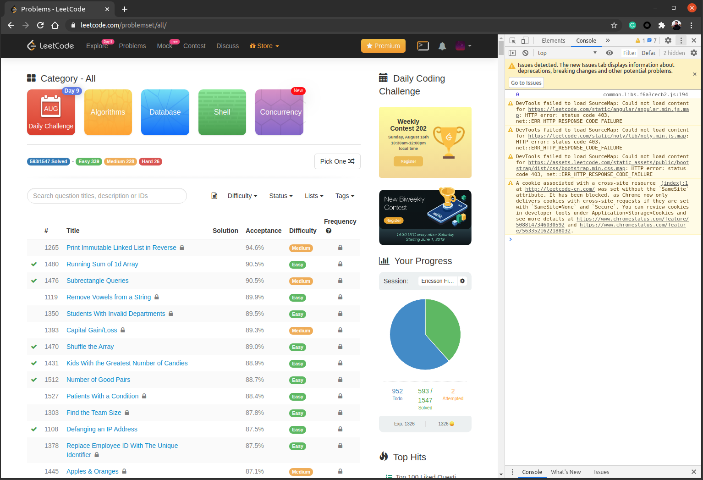
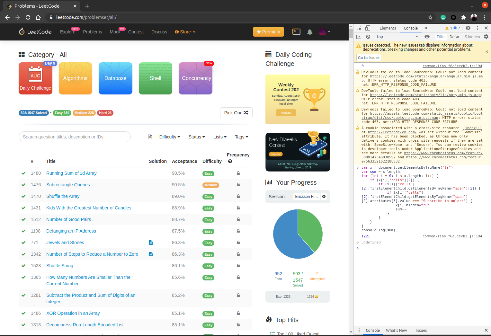

# How to remove leetcode premium problems from your problem list

### For PROs
```javascript
var x = document.getElementsByTagName("tr");
var sum = x.length;
for (let i = 0; i < x.length; i++) {
    if (x[i]["cells"][2]) {
        if (x[i]["cells"][2].firstElementChild.getElementsByTagName("span")[1]) {
            if (x[i]["cells"][2].firstElementChild.getElementsByTagName("span")[1].attributes[3].value === "Subscribe to unlock") {
                x[i].hidden=true
                sum--
            }
        }
    }
}
console.log(sum)
```

### For newbees, step by step

- login to your leetcode account
- go to the leetcode problems page
  - [All TODOs](https://leetcode.com/problemset/all/?status=Todo)
  - [All Easy TODOs](https://leetcode.com/problemset/all/?status=Todo&difficulty=Easy)
  - [All Medium TODOs](https://leetcode.com/problemset/all/?status=Todo&difficulty=Medium)
  - [All Hard TODOs](https://leetcode.com/problemset/all/?status=Todo&difficulty=Hard)


- Press `F12` to open browser dev tools -> `Console`


- `Ctrl+C` the javascript code above and `Ctrl+V` to the console then press `Enter`
- Check the result, all the locked/premium problems disappeared
  > *Tip:* those premium problems will show up again if you refresh the page, so you'd better `Open link in a new TAB`.




